# GIT

Git est un gestionnaire de versions tandis que GitHub est un service en ligne qui héberge les dépôts Git. On parle alors de *dépôt distant*.

**Un gestionnaire de version sert à :**

1. Revenir à une version précédente de votre code en cas de problème.
2. Suivre l’évolution de votre code étape par étape.
3. Travailler à plusieurs sans risquer de supprimer les modifications des autres collaborateurs.

**Le dépôt distant (repository):**

Le **dépôt distant** egit un peu différent. Il permet de stocker les différentes versions de votre code afin de garder un **historique délocalisé**, c'est-à-dire un historique hébergé sur Internet ou sur un réseau.

**Le dépôt local :**

- Un dépôt local est l’endroit où l’on stocke, sur sa machine, une copie d’un projet, ses différentes versions et l’historique des modifications.

Configurer identité :

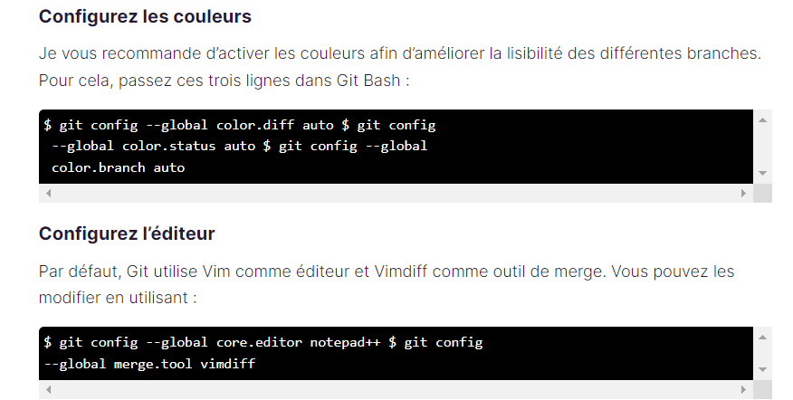

**Initialiser le dépôt en créant un dépôt local vide :**

A réaliser dans le dossier où on veut mettre le projet

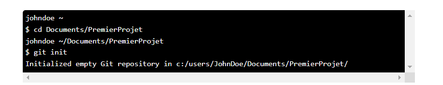

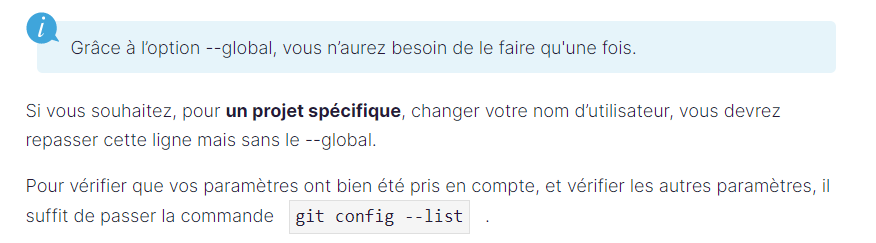

Pour envoyer le fichier il faut l’indexer puis commit puis push

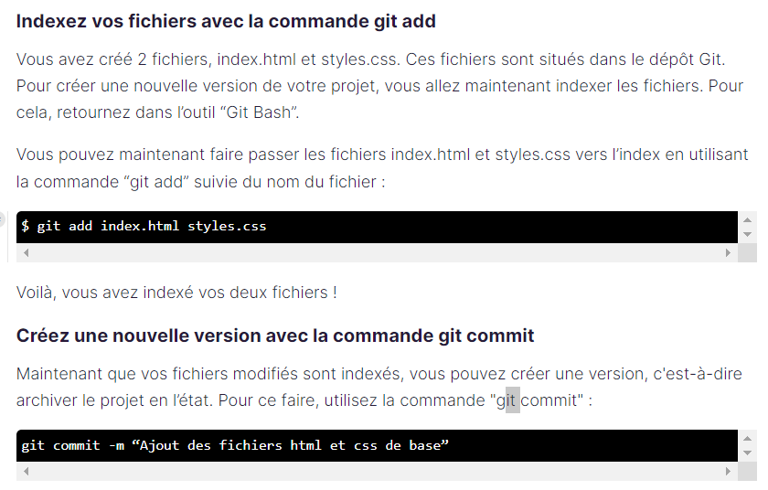

On utilise add et commit chaque fois qu’on modifie le projet, mais on utiliser git push quand on veut l’envoyer.

On peut retrouver les version de commit avec : git log --oneline

Pour retourner à une précédente version si on a déjà commit : git reset –hard « on fait copier coller l’identifiant de la version qu’on veut , lister juste avant ».

Git reflog : permet d’afficher l’historique de toutes les manip qui ont eu lieu ( ex utile si on veut au final garder la dernière version)

Pour changer le msg du dernier commit :

*Pour le premier push : On s’en sers pas trop*

*1)Prendre l’adresse du dépôt sur github puis faire la commande ( tout à la suite) : le lien à copier est celui de l’adresse du dépôt.*

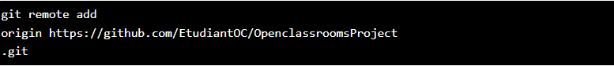

*2) on fait cette commande :*

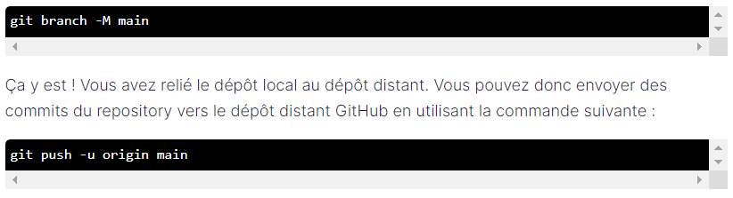

Si on travaille dans une autre branche on remplace « main » par le nom de la branche en question.

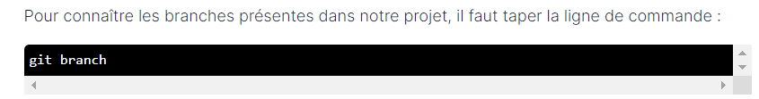

L’étoile nous montre sur quelle branche on travail.

Pour ajouter une branche : git branch ‘’nom de la branche’’

Pour changer sur quelle branche on travail : git checkout ‘’nom de la branche où on veut travailler’’

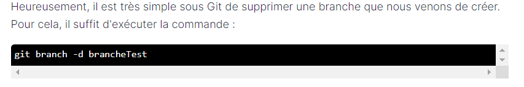

Git stash : permet de mettre de côté des modifications qui n’ont pas été commit pour les réutiliser plus tard.

On peut voir l’état des modification avec git status. Puis on va ou on créer la branche ou on veut modifier, on fait git stash list pour voir les modifications mise de côté. On fait ensuite git stash apply « copier-coller le nom de la modif entre crochet) » . Et là nos modif du début qui était pas au bonne endroit ce sont mise dans la branche voulu.

Pour fusionner une branche avec la branche principale main (il faut faire un merge) :

1. On bascule sur la branche ou on veut fusionner (exemple main)
2. Git merge ‘’nom de l’autre branche ou on a travaillé’’ ( exemple cagnotte)
3. Faire le commit –m ‘’………………………..’’

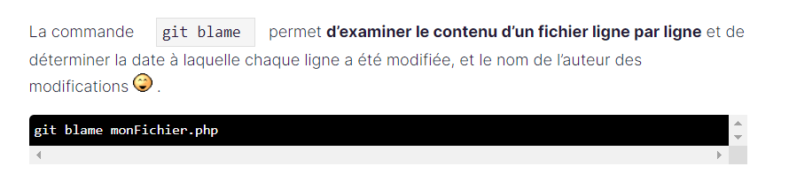

Pour résumer sur GIT : on génére la clé SSH, on la copi colle dans github puis on fait ça :

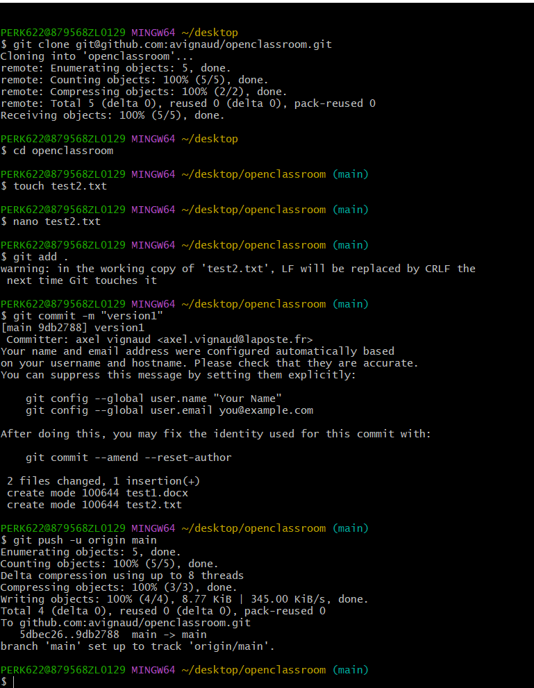

Pour se ajouter un fichier avec un autre ordi obliger de renseigner nom + mail, et créer une nouvelle clef ssh.

Pour demander si on peut fusionner notre branch avec la main :

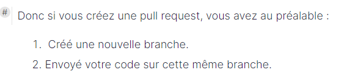

Registry docker sur gitlab : permet de stocker des images

1. Sur gitlab : aller dans package and registries puis container registry.
2. Copier coller l’adresse docker login