# Monter un serveur fichier sous linux

1. Créer une vm client,
2. Eteindre la vm puis dans configuration rajouter une autre carte réseau en ***‘’réseau interne’’***
3. Dans l’interface graphique de la vm-client, Dans les paramètres, dans la nouvelle carte réseau, dans ipv4, mettre en manuel et remplir l’adresse ip (192.168.29.2 et 255.255.255.0) + masque réseau. Puis ***‘’Appliquer’’.***
4. nano /etc/hosts rajouter dans ce fichier l’adresse ip du serveur suivis du nom du serveur

exemple :

1. Créer une vm serveur ( avec le bon iso ubuntu serveur)
2. Paramétrer l’installation. Penser à cocher ***‘’use entire disk’’*** et écocher ‘***’Set up this disk as an LVM group’’***
3. Eteindre la vm puis dans configuration rajouter une autre carte réseau en ***‘’réseau interne’’***
4. Configurer la nouvelle interface réseau :
5. ***ip a*** = permet de voir la configuration réseau
6. ***cd /etc/netplan***
7. créer un nouveau fichier, faire ***sudo nano 60-lan-statique.yaml***
8. remplir ce fichier de cette manière :
    
    
    
9. Enregistrer puis, ***sudo netplan apply***
10. ***ip a*** = pour vérifier si les changements ont bien été pris en compte.
11. ***Sudo nano /etc/hosts*** ajouter dessous les 2 premières adresses l’adresse ip de notre client avec son nom.

> Exemple :
> 
> 
> 
> 
1. Tester la connexion en faisant un ***ping « nom_du_serveur »*** depuis le client et un ***ping « nom_du_client »*** depuis le serveur.

**Ajouter un disque sur notre serveur** (pour partager des fichiers par exemple) :

1. Une fois le serveur éteint aller dans configuration -> stockage -> contrôleur : SATA -> cliquer sur l’icône ajouter un disque -> créer -> (configurer le disque) -> choisir.
2. Démarrer le serveur puis afficher les périphériques avec ***: ls –l /dev/sd**** (car les disques commence par sd)

1. Pour avoir des infos sur un disque : ***sudo gdisk –l /dev/sda*** <- (nom du disque)
2. Pour utiliser le nouveau disque (sdb) on va devoir le partitionner : ***sudo gdisk /dev/sdb*** -> ***n*** -> ***entrée*** plusieurs fois -> ***p*** pour afficher la partition créer -> ***w*** pour l’écrire sur le disque.
3. Il faut ensuite le formater : ***sudo mkfs –t ext4 /dev/sdb1***.<- nom de la partition à formater
4. Il faut maintenant monter la partition pour y lire et écrire des fichiers : ***mkdir –p /var/data1/non_monte***
5. ***mkdir –p /mnt/mes_donnees***
6. ***mount –t ext4 /dev/sdb1 /mnt/mes_donnees***
7. ***mkdir /mnt/mes_donnees/dir1***
8. ***ls –l /mnt/mes_donnees/***
9. ***umount /dev/sdb1***
10. ***ls –l /mnt/mes_donnees/***
11. ***mount –t ext4 /dev/sdb1 /var/data1***
12. ***ls –ls /var/data1*** <- on retrouve le répertoire dir1 sur le nouveau point de montage
13. Pour que le montage se fasse automatiquement au démarrage du système :

> nano /etc/fstab
> 
> 
> Compléter dessous la dernière ligne comme dans l’exemple :
> 
> 
> 
1. ***mount –a***

Optimiser une partition ext4 avec tune2fs :

- ***tune2fs –l /dev/sdb1 |less*** pour voir la liste de ses attributs

UUID = permet d’identifier la partition

Reserved block count = block réservés à l’utilisateur root

- pour voir la taille de la partition : ***df –h /dev/sdb1***
- pour mettre le nombre de bloc réservés à 0 et mettre un label (un nom) pour notre partition : ***tune2fs /dev/sdb1 –m 0 –L DATA1***
- pour voir la taille de la partition (qui doit être plus élevée maintenant) : ***df –h /dev/sdb1***

Redimensionner une partition ext4 :

- Il faut démonter la partition : ***umount /dev/sdb1***
- Vérifier que la partition est en bonne santé et sans erreur : ***e2fsck –f /dev/sdb1***
- Redimensionner le système de fichier ext4 : ***resize2fs /dev/sdb1 700M*** taille souhaitée
- Pour le redimensionnement il faut réduire le system de fichier ext4 mais aussi la partition : ***gdisk /dev/sdb*** lister les partitions avec la commande ***p*** puis commande ***d*** pour supprimer la partition créer une nouvelle partition avec la commande ***n entrer 2x*** puis on va lui demander de se terminer à 800M, on tape ***800M*** à la ligne 3. on remet un code ***8300*** à la ligne 4 on écrit sur le disque le nouveau partitionnement avec la commande ***w***
- Il faut redimensionner le système de fichier ext4 : ***resize2fs /dev/sdb1***

Créer une seconde partition :

- ***gdisk /dev/sdb***
- ***n*** en position 2 qui commence à la fin de la 1ére partition qui se termine à la fin du disque code 8200 qui correspond au système, de fichier swap (système d’échange qui permet a linux de l’utiliser s’il n’y a pas assez de mémoire vive).
- ***w***
- ***free –m :*** pour voir la taille de notre swap
- formater la partition swap : ***mkswap /dev/sdb2***
- activer la swap : ***swapon /dev/sdb2***
- ***free -m :*** pour voir que notre swap c’est agrandit de 200 mégaoctets
- pour que la swap soit active au démarrage il faut modifier le fichier : ***nano /etc/fstab***
- on rajoute une dernière ligne :
    
    
    

Sécuriser les données avec RAID :

- Il faut avant tout préparer le serveur, en commençant par l’éteindre : ***shutdown –h now***
- Dans ***configuration stockage contrôleur SATA ajouter un disque dur*** choisir ***1 GIGA*** (les disques doivent faire la même taille) le nommé ***spare***
- Créer un autre disque de 1GO peut importe le nom.

- Démarrer le serveur
- Vérifier que les disques ont bien été créés : ***ls –l /dev/sd****
- Supprimer les entrée qui ont été ajoutées précédemment : ***nano /etc/fstab***

- On démonte la partition : ***umount /dev/sdb1***
- On désactive la swap : ***swapoff /dev/sdb2***

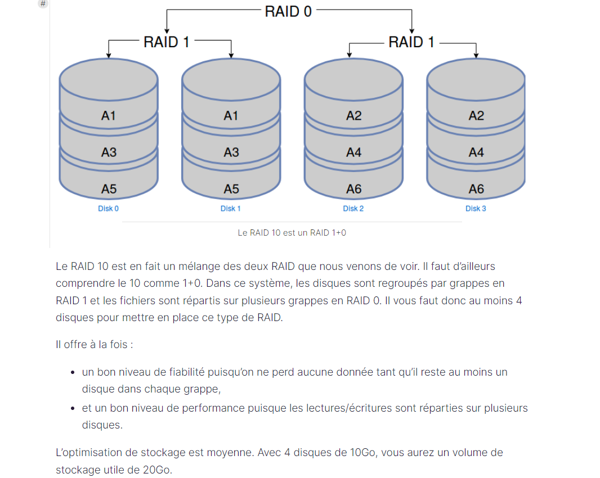

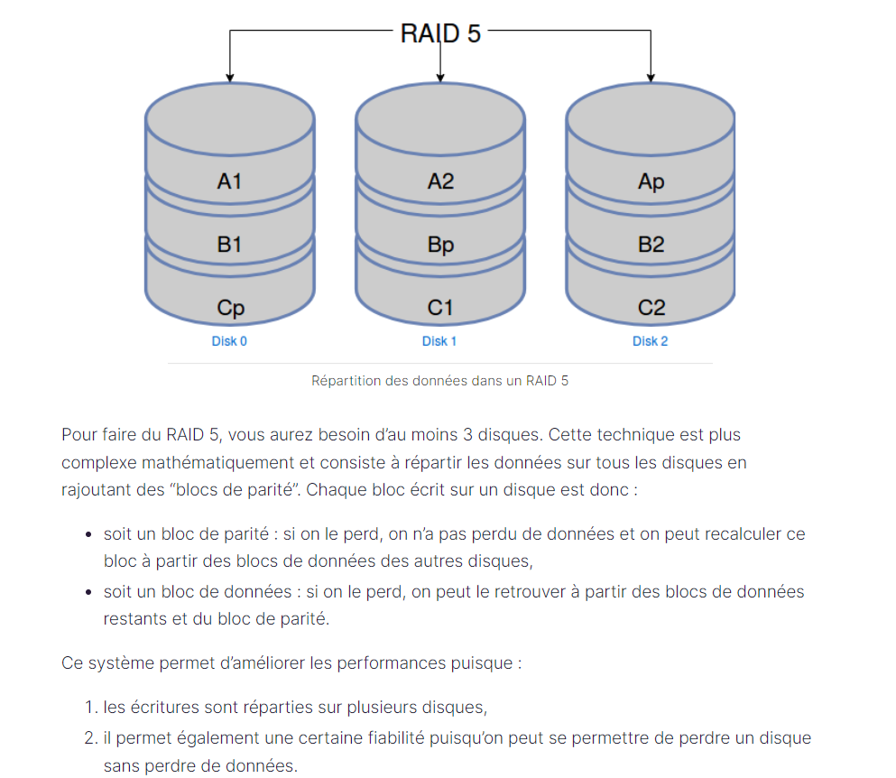

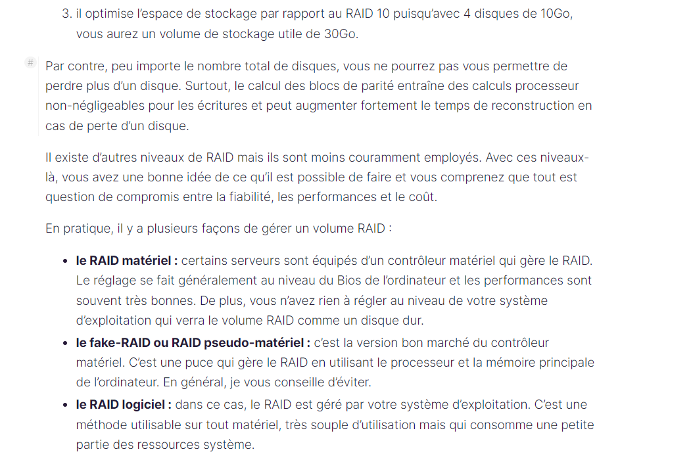

Mettre en place un raid 1 pour sécuriser les données :

- créer la partition raid : ***mdadm - - create /dev/md0 - - level=raid1 - - raid-devices =2 /dev/sdb /dev/sdc - -spare-devices =1 /dev/sdd***
- Avoir des renseignements sur le raid : ***mdadm - - query - - detail /dev/md0***
- Formater le volume raid 1 : ***mkfs –t ext4 /dev/md0***
- Monter ce volume raid : ***mount –t ext4 /dev/md0 /var/data1***
- Pour tester on essaye en créant un fichier sur le volume raid : ***touch /var/data1/mon_premier_fichier***
- On peut simuler la perte d’un disque physique : ***mdadm - -manage /dev/md0 - -fail /dev/sdb***
- Si maintenant on va voir les détails de notre raid : ***mdadm - -query - - detail /dev/md0*** on voit que le disque ***/dev/sdb*** est en ***faulty*** et que ***/dev/sdd*** à prit le relais.
- On peut retirer le disque défectueux : ***mdadm - - manage /dev/md0 - -remove /dev/sdb***
- En réalité il faut changer le disque, avec un nouveau disque neuf ici on va juste réinsérer le disque ***sdb*** dans le volume raid : ***mdadm - -manage /dev/md0 - -add /dev/sdb***
- Si on regarde de nouveau dans notre raid on voit que /dev/sdb est déclaré comme étant un disque de ***spare*** : ***mdadm - -query - -detail /dev/md0***

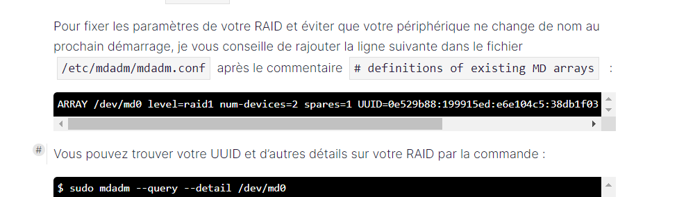

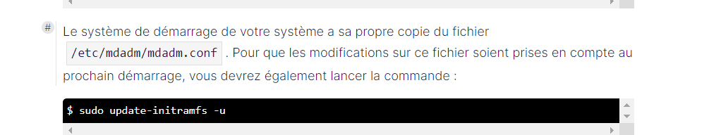

Utiliser notre volume RAID avec un LVM :

- Démonter notre RAID : ***umount /dev/md0***
- On le marque comme si c’était un volume physique : ***pvcreate /dev/md0***

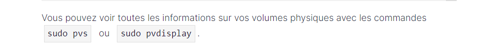

- Intégrer ce volume physique dans un groupe de volume : ***vgcreate raid-volume /dev/md0***
- 

> 
> 
- Créer des volumes logique (= des partitions dans le monde lvm) : ***lvcreate - -name data1 - - size 800M raid-volume***

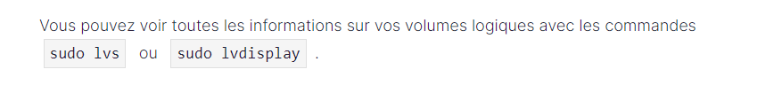

- On créer un deuxième volume logique : ***lvcreate - -name data2 - - size 200M raid-volume***
- Il faut la formater : ***mkfs –t ext4 /dev/raid-volume/data1***
- On fait pareil avec la deuxième : ***mkfs –t ext4 /dev/raid-volume/data2***
- On monte le volume logique : ***mount –t ext4 /dev/raid-volume/data1 /var/data1***
- On fait la même chose avec data2, on commence par créer le dossier : ***mkdir /var/data2***
- ***mount –t ext4 /dev/raid-volume/data1 /var/data2***

> Redimensionnez des volumes avec LVM :
> 
> - il faut démonter les montages : ***umount /var/data1***
> - ***umount /var/data2***
> - on réduit la taille du volume logique de data1 : ***lvreduce - -size 600M - -resizefs /dev/raid-volume/data1***
> - on peut éteindre le serveur pour ajouter un second disque : ***shutdown –h now***
- ajoute un second disque pour creer le second RAID : Dans ***configuration stockage contrôleur SATA ajouter un disque dur*** choisir ***1 GIGA***
- On regarde que notre disque ***/dev/sdb*** est bien en spare : ***mdadm - -query - - detail /dev/md0***
- On va mettre en erreur le disque et l’enlever directement du RAID : ***mdadm /dev/md0 - - fail /dev/sdb - -remove /dev/sdb***
- On recréer un RAID 1 : ***mdadm - -create /dev/md1 - -level=raid1 - -raid-devices=2 /dev/sdb /dev/sde***
- On ajoute ce RAID à ce groupe de volume, on indique d’abord que c’est un volume physique : ***pvcreate /dev/md1***
- ***vgextend raid-volume /dev/md1 :*** permet d’ajouter le nouveau raid ***/dev/md1*** au groupe du volume ***raid-volume***.
- ***vgs*** : permet de voir la taille de notre groupe de volume
- on va maintenant éteindre le volume de 200M a 1,4Giga : ***lvextend - -size +1200M - -resizefs /dev/raid-volume/data2***

Utiliser NFS :

> - commencer par installer le package NFS : apt install nfs-server
> 
> - ensuite on créer une arborescence séparé : ***mkdir –p /export/home*** extension des dossiers utilisateurs
> - ***mkdir /export/shared*** répertoire commun entre plusieurs utilisateurs.
> - ***nano /etc/fstab*** : pour monter les dossiers var data1 dans l’export home et var data2 dans l’export shared.
> 
> 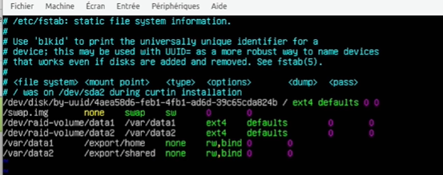
> 
> - ***nano /etc/export*** : fichier de configuration de partage NFS. Chaque ligne correspond à un point de montage.
> 
> 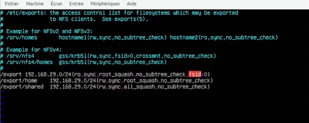
> 
- ***exportfs –r***
- on vérifie que les répertoires sont exportés sur le bon réseau : ***showmount –e localhost***
- on peut maintenant configurer le client pour accéder à ses répertoires.

**Configurer le client : ( pensez à le faire sur le client et non le serveur)**

- ***sudo apt install nfs-common***
- ***sudo mkdir –p /mnt/reseau***
- ***sudo nano /etc/fstab***

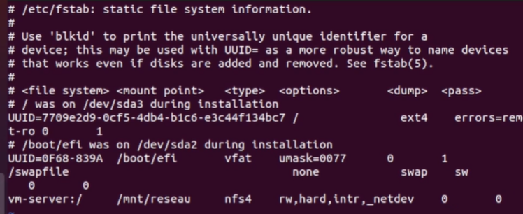

- Active le point de montage nfs : ***sudo mount –a***
- ***ls –l /mnt/reseau :*** on va voir nos 2 répertoires mais ils appartiennent à root et on a pas le droit d’écriture dessus.
- on récupères les UID et GID de notre utilisateur : ***id ‘’nom d’utilisateur’’***
- **SUR LE SERVEUR** : dans /export : ***mkdir /home/’’nom d’utilisateur’’***
- ***chown ‘’UID et GID de l’utilisateur’’*** (ex 1000:1000) ***home / ‘’nom d’utilisateur’’***
- ***chown nobody:nogroup shared/***
- SUR LE CLIENT : ***ls –l /mnt/reseau :*** on regarde si on a les bons droits maintenant
- on fait un test d’écriture : ***touch /mnt/reseau/home/’’nom d’utilisateur’’/test***
- ***ls –l /mnt/reseau/home/’’nom d’utilisateur’’/*** : on regarde qu’on a bien le fichier de test avec le bon nom d’utilisateur.
- test d’écriture dans le répertoire shared : ***touch /mnt/reseau/shared/testshared***
- ***ls –l /mnt/reseau/shared/testshared*** : il y a bien les bons droits en anonyme

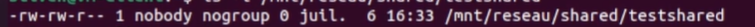

**Partager les fichiers sur un réseau hétérogène avec Samba :**

- Configure le serveur : ***apt install samba***
- ***nano /etc/samba/smb.conf***

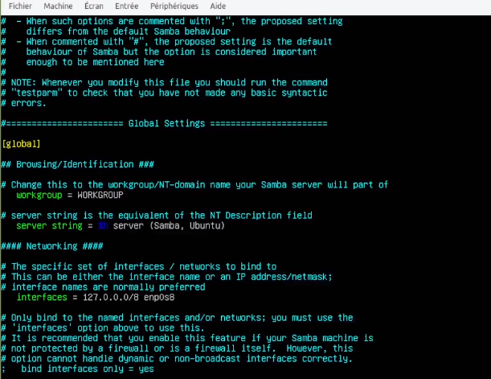

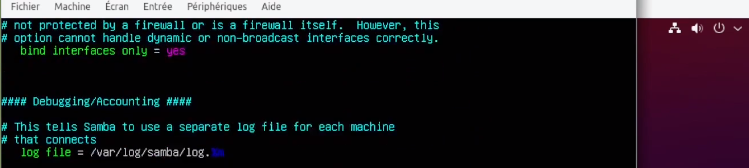

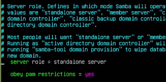

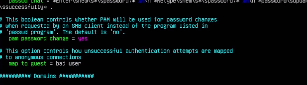

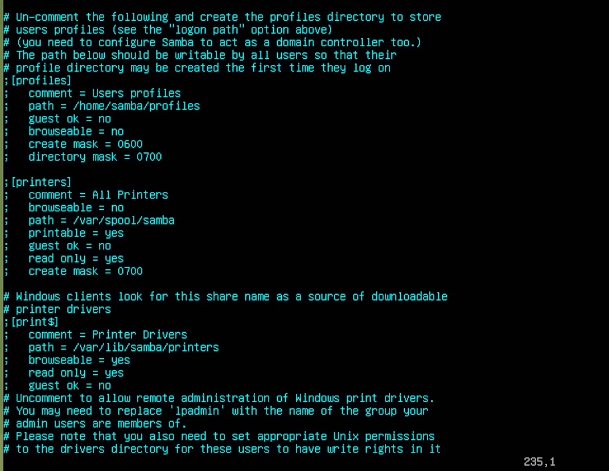

A la fin du fichier on ajoute :

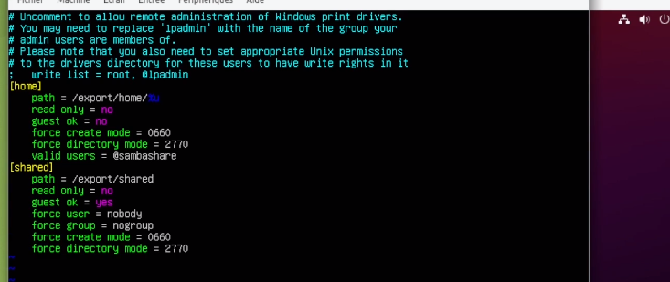

- On applique la configuration : ***systemctl restart smbd***
- Onajoute notre utilisateur au groupe samba/share : ***usermod –aG sambashare ‘’nom’dutilisateur’’***
- Il faut aussi enregistrer dans la base utilisateur de samba : ***pdbedit –a ‘’nom utilisateur’’***
- On fait parreil avec le compte nobody : ***pdbedit –a nobody***

**Configurer le client :**

- Sur le client : ***sudo apt install smbclient cifs-utils***
- ***smbclient –U ‘’nom utilisateur’’ //vm-server/home*** : pour accéder au partage
- on à accès au fichier
- deuxième moyen d’accéder au partage : ***sudo mkdir –p /mnt/samba/home***
- ***sudo mkdir –p /mnt/samba/shared***
- ***nano /etc/fstab***

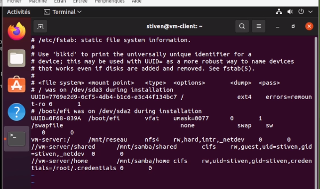

- on créer le fichier : sudo nano /root/.credentials

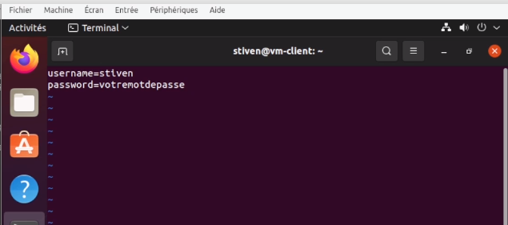

- vu que le fichier contient en mot de passe on réduit les droits dessus : ***sudo chmod 600 /root/.credentials***

On monte nos montages : ***sudo mount –a***

On test de créer un fichier : ***touch /mnt/samba/home/testSamba***

On test aussi sur shared : ***touch /mnt/samba/shared/testSambaShared***

**SUR LE SERVEUR** : On vérifie si les fichiers sont bien avec les bons propriétaires : ***cd /export/home/’’nom utilisateur’’***

- ***ls –l***

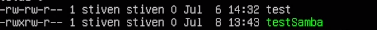

On fait pareil avec le shared :

***ls –s ../../shared/***

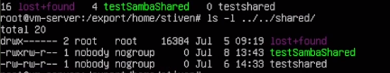