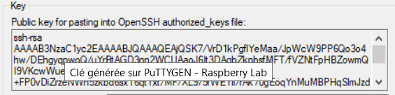

# connexion ssh sur raspberry

1. Installer raspbian
2. Une fois sur l’écran d’acceuil, aller dans l’icône framboise en haut a gauche ->***préferences***>***configuration du raspberry pi*** -> ***interfaces*** et activer le ssh.
3. Attribuer une adresse IP ( cf configuration réseau)
4. Taper ***sudo raspi-config*** , dans ***6 advanced option*** -> ***AA network config*** -> sélectionner ***network manager***
5. Aller su putty, renseigner l’adresse IP et le port (22).
6. Taper nom utilisateur du rasp et mdp , la connexion est établit.

Connexion au Rasp avec clé ssh :

1. Aller sur puttygen pour générer la clé ssh (RSA)
2. Clique sur ***save private key*** pour sauvegarder la clé privée au format .ppk
3. Sur le raspberry (il faut le manipuler en ssh depuis le poste) On tape la commande ***ls -a ~ | grep "^[.]"*** pour vérifier si le fichier .ssh existe, s’il il existe pas il faut faire ***mkdir ~/.ssh*** on refait ensuite la commande ***ls -a ~ | grep "^[.]"*** pour voir si le fichier.ssh à bien était créé.
4. On ajoute ensuite la clé publique au fichier ***authorized_key*** qui se trouve ou pas dans ***.ssh***, cette commande permet de l’écrire dans le fichier et de le créer en même temps s’il existe pas : ***echo "VOTRE_CLE_PUBLIQUE" >> ~/.ssh/authorized_keys***

La clé publique est la longue série de caractère dans le premier encadré de putty

1. Dans putty, normalement l’adresse IP et le port sont déjà renseignés.
2. Dans ***Connection* > *SSH* > *Auth***. Cliquez sur ***Browse*** pour sélectionner la clé privée que vous avez sauvegardée à l'étape 1 au format **.ppk**.
3. Retourner dans ***session*** et cliquer sur ***save*** puis ***open***.
4. Normalement avec l’identifiant renseigner sur le rasp on se connecte directement, si on veut le faire pour d’autre utilisateur du rasp il faut refaire la manip sur la session de l’utilisateur en question.