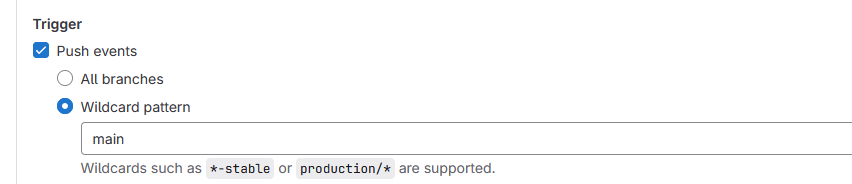

# webhook git pour openshift

but : Automatiser le build d’une image openshift à chaque modification du code git dans la branche main

## 1) Configurer le buildconfig

Rajouter ceci dans le fichier yaml du buildconfig

```yaml
triggers:
    - type: GitLab
      gitlab:
        secretReference:
          name: gitlab-webhook-secret
```

## 2) Créer le secret avec une clé:

1. Générer la clé
    
    ```bash
     openssl rand -hex 16
    ```
    
2. L’encoder en base64

```bash
 echo -n <clé_générée> | base64
```

c) exemple de fichier secret avec la clé renseignée et encodée en base64

```yaml
kind: Secret
apiVersion: v1
metadata:
  name: webhook-secret
  namespace: wdx-sdev
data:
  WebhookSecretKey: ZWQ5ZTYzMTllZDYxZTJmYTM3OTQxN2FlMGIyMTQzNDY0YmY1Y2QzMQ==
type: Opaque
```

## 3) configuration Gitlab

1. créer un webhook et renseigné dans la partie url l’url reçus grâce a la commande sur openshift :

```bash
oc describe bc/<name-of-your-BuildConfig>
```

remplacer la valeur <secret> de l’url par la clé générée décodée

b) Renseigner dans secret token la clé décodée une nouvelle fois

c) sélectionner l’option *(pour choisir le déclenchement automatique seulement sur la branche main)*



et : (pour les merges de la branch dev à main par exemple)

